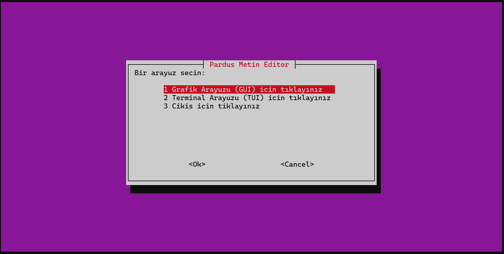
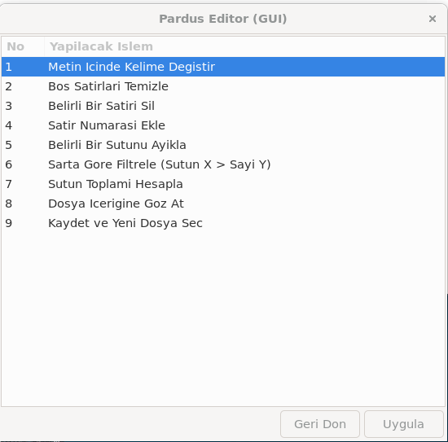
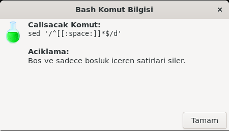
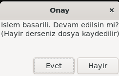
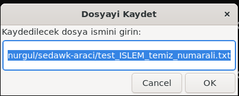
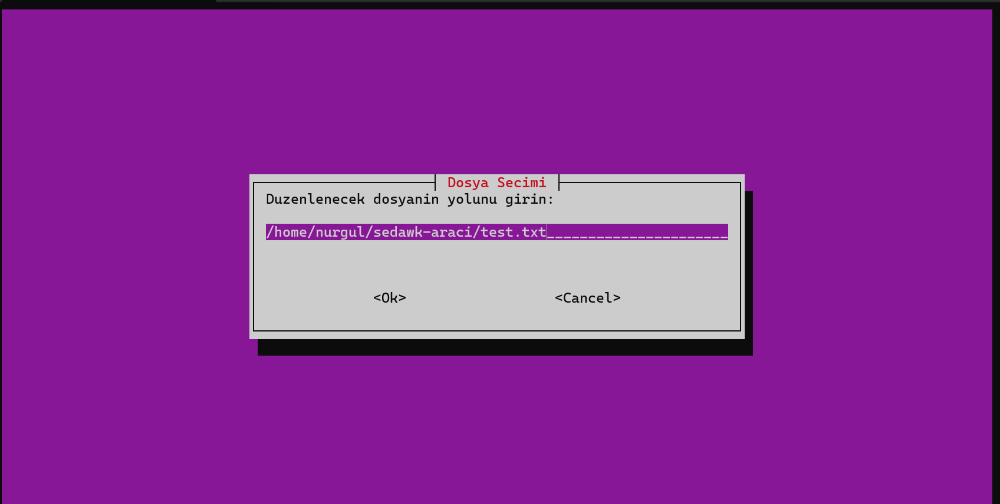
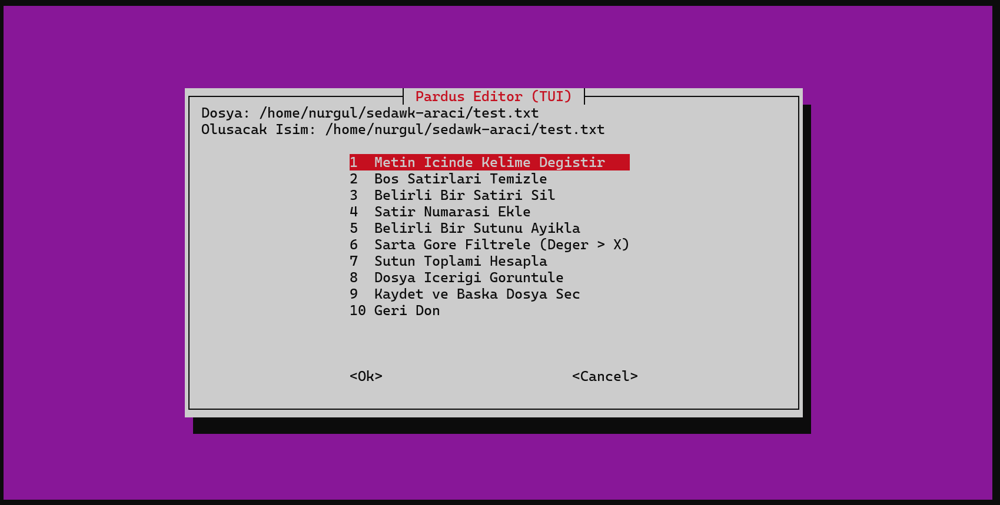
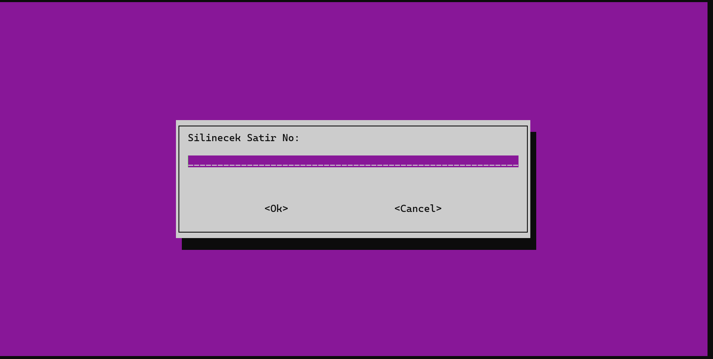
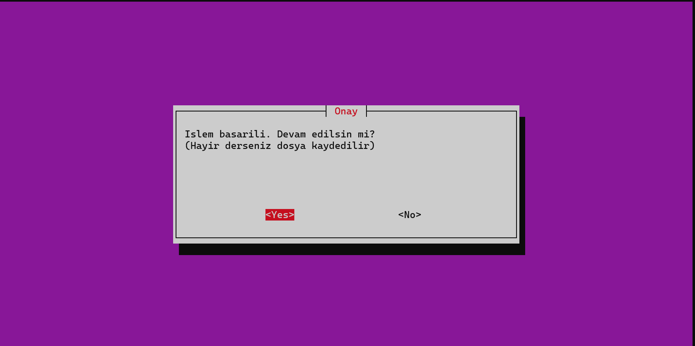
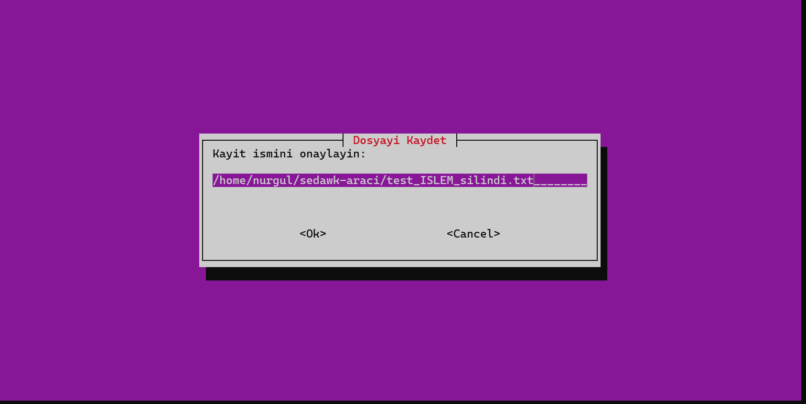

# Sed Awk Editor
### Sed & Awk Tabanlı Metin Düzenleyici 

Sed Awk Editor, Linux sistemlerde (özellikle **Pardus**, Ubuntu ve Debian) metin dosyaları üzerinde **sed** ve **awk** komutlarını kullanıcı dostu bir arayüzle kullanmayı sağlayan bir **Shell Programming uygulamasıdır**.

Uygulama hem **Grafik Arayüz (GUI – YAD)** hem de **Terminal Arayüzü (TUI – Whiptail)** sunarak farklı kullanım senaryolarına uyum sağlar.

---

## Proje Tanıtımı ve Amacı

Bu proje, komut satırında karmaşık görülebilen `sed` ve `awk` işlemlerini **menü tabanlı ve etkileşimli** bir yapıya dönüştürmeyi amaçlar.

Sed Awk Editor sayesinde kullanıcılar:

- Metin içinde kelime değiştirme
- Boş satırları temizleme
- Satır numarası ekleme
- Belirli sütunları ayıklama
- Sayısal sütunlar üzerinde filtreleme ve toplama

gibi işlemleri **kod yazmadan**, güvenli ve kontrollü bir şekilde gerçekleştirebilir.

Uygulamanın ayırt edici özelliği, yapılan her işlemin arka planda çalışan **sed** ve **awk** komutlarını kullanıcıya göstermesidir. Bu sayede proje yalnızca bir araç değil, aynı zamanda **öğretici bir eğitim uygulaması**dır.

---

##  Özellikler

- **Çift Arayüz Desteği**
  - Grafik Arayüz (GUI): `yad`
  - Terminal Arayüzü (TUI): `whiptail`

- **Güvenli Dosya İşleme**
  - Orijinal dosya korunur
  - Tüm işlemler geçici dosyalar üzerinde yapılır

- **Otomatik Yedekleme**
  - Dosya kaydedilirken mevcut dosyanın `.bak` uzantılı yedeği alınır

- **Özel Karakter Koruması**
  - `/`, `&`, `.`, `*` gibi özel karakterler otomatik olarak escape edilir
  - `sed` kaynaklı hataların önüne geçilir

- **Eğitici Mod**
  - Çalıştırılan `sed` ve `awk` komutları açıklamalarıyla birlikte gösterilir

---

## Kurulum ve Sistem Gereksinimleri

### Desteklenen Sistemler
- Pardus
- Ubuntu
- Debian

### Gerekli Paketler
- `bash`
- `sed`
- `awk`
- `yad`
- `whiptail`

### Bağımlılıkların Kurulması

```bash
sudo apt update
sudo apt install yad whiptail -y
```


## Uygulamanın Çalıştırılması

1) Depoyu klonlayın:
```bash
git clone https://github.com/nurgull6872/sedawk-araci.git
```

2) Proje dizinine girin:
```bash
cd sedawk-araci
```

3) Çalıştırma izinlerini verin:

```bash
chmod +x *.sh
```

4) Ana programı başlatın:

```bash
./ana_program.sh
```

##  Kullanım Kılavuzu 
### Arayüz Seçimi


Daha detaylı uygulama videosu için aşağıdaki linki kullanabilirsiniz:

[PROJE ANLATIM VE KULLANIM VİDEOSU](https://www.youtube.com/watch?v=qmT9KEIz0GE)


Ayrıca aşağıda detaylı olarak arayüz fotoğrafları ile birlikte anlatılmaktadır.


Program başladığında kullanıcıdan aşağıdaki arayüzlerden biri seçmesi istenir:

-Grafik Arayüz (YAD)

-Terminal Arayüzü (Whiptail)





***Eğer arayüz olarak gui seçilirse***

İşlem yapılacak dosya seçildikten sonra aşağıdaki menü ekranı ile karşılaşacaksınız





Kaydet seçeneğine basarsak dosyamızın .bak uzantılı yedeği aynı dizinde oluşturulmuş olacaktır.


Devamında yapılacak işlemi seçtikten sonra ise size aynı zamanda bilgi vermek adına komutun çıktısını ve bilgisini göreceksiniz





Aynı dosya üzerinden işlem yapmak isterseniz eğer dosya kaydedilmeyecektir ama farklı bir dosya işlemine geçerseniz dosya kaydedilecek olup karşınıza dosya ismini kullanıcının belrileyebileceği
bir ekran çıkmaktadır. Herhangi bir isim verilmez ise default olarak yapılan işlemleri barındıran bir isim çıktısı yeni dosyamızın ismi olacaktır.








Aynı şekilde tüm işlemleri grafiksel bir arayüze ihtiyaç duymadan da tui üzerinden de gerçekleştirilebilir. Aşağıda aynı işlemlerin tuiye ait görselleri bulunmaktadır.

















